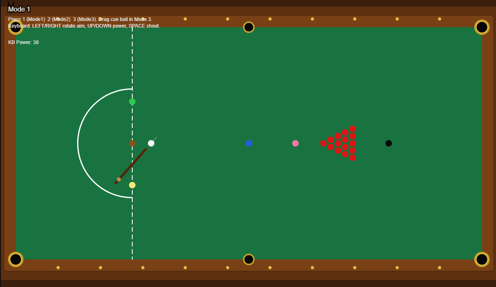
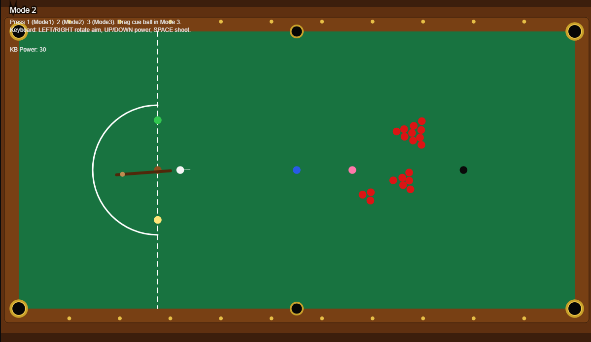
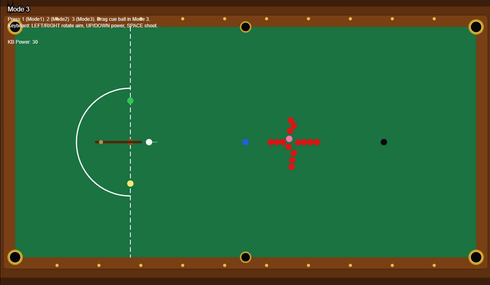

# Snooker Game Simulation (JavaScript / p5.js / Matter.js)

## Overview
This project is an interactive snooker game simulation developed using JavaScript, combining p5.js for rendering and Matter.js for realistic physics simulation. The application recreates a playable snooker table with accurate ball behaviour, collision physics, and multiple gameplay modes.

The system is designed using a modular object-oriented architecture, where each component of the game (table, balls, cue, animations, and game logic) is encapsulated within its own class. This ensures scalability, maintainability, and clear separation of concerns.

---

## Features

- 🎱 Realistic snooker physics using Matter.js  
- 🎮 Interactive cue system (mouse + keyboard control)  
- 🎯 Shot charging and directional aiming  
- 🔄 Multiple game modes:
  - Mode 1: Official snooker setup  
  - Mode 2: Random ball clusters  
  - Mode 3: Practice mode with repositionable cue ball  
- 💥 Collision handling with restitution and friction  
- ✨ Visual effects:
  - Ball trails  
  - Pocket animations  
  - Dynamic restitution boost  
- 🧱 Fully rendered snooker table with cushions and pockets  
- 🎥 Real-time game loop and rendering  

---

## Technologies Used

- **JavaScript (ES6)**
- **p5.js** (graphics and rendering)  
- **p5.sound.js** (audio support)  
- **Matter.js** (physics engine)  
- HTML5  

---

## How It Works

The game follows a structured architecture with clearly defined components:

### 🎮 Game Controller
The central controller manages the physics engine, updates all objects, and coordinates rendering each frame 

### 🎱 Ball Physics
Each ball is represented as a rigid body with properties such as restitution, friction, and density. Motion, collisions, and pocket detection are handled dynamically 

### 🎯 Cue System
The cue allows the player to aim and shoot using:
- Mouse drag (power-based shooting)
- Keyboard input (precision control)  

### 🧱 Table System
The snooker table includes:
- Cushions (collision boundaries)
- Pockets (for ball detection)
- Accurate scaling and proportions   

### 🎨 Animations
Visual effects enhance realism:
- Ball trails
- Pocket animations
- Temporary physics boosts after shots 

### 🔄 Game Modes
Different gameplay setups are managed by a dedicated mode system, allowing easy switching between layouts 

---
## Game Modes

### Standard Mode


### Challenge Mode


### Training Mode


## How to Run

1. Ensure all files are in the correct structure:
   - `index.html`
   - `main.js`
   - All class files (Ball, Cue, Game, etc.)
   - `libraries/` folder containing:
     - p5.js
     - p5.sound.js
     - matter.js  

2. Open the project in a browser:
```text
index.html